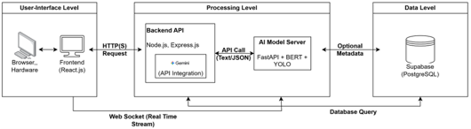
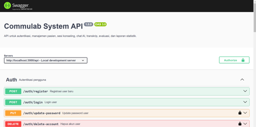
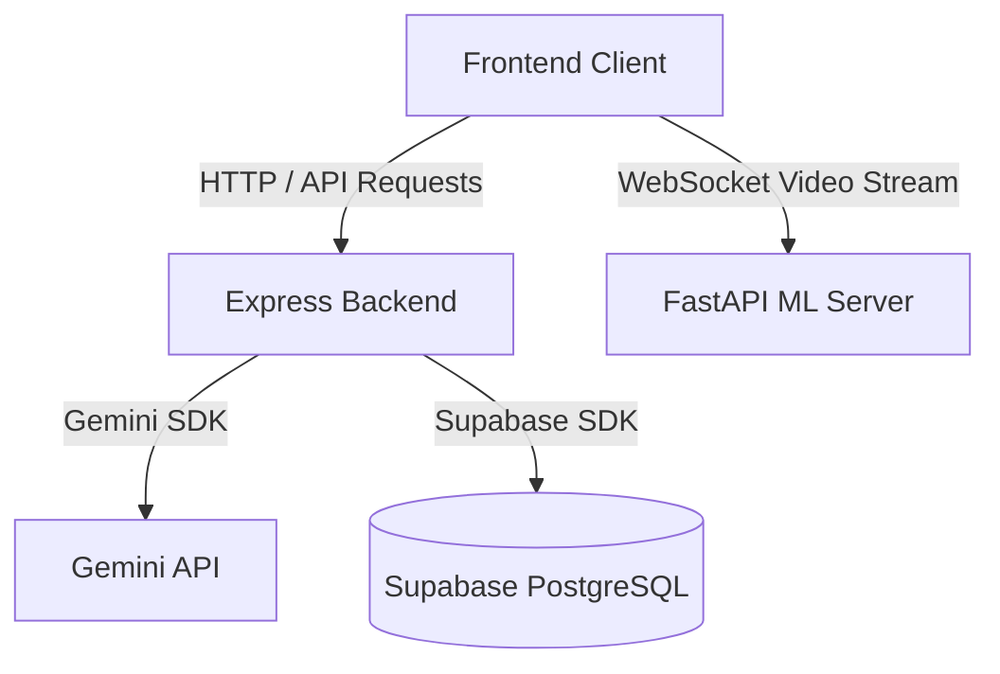
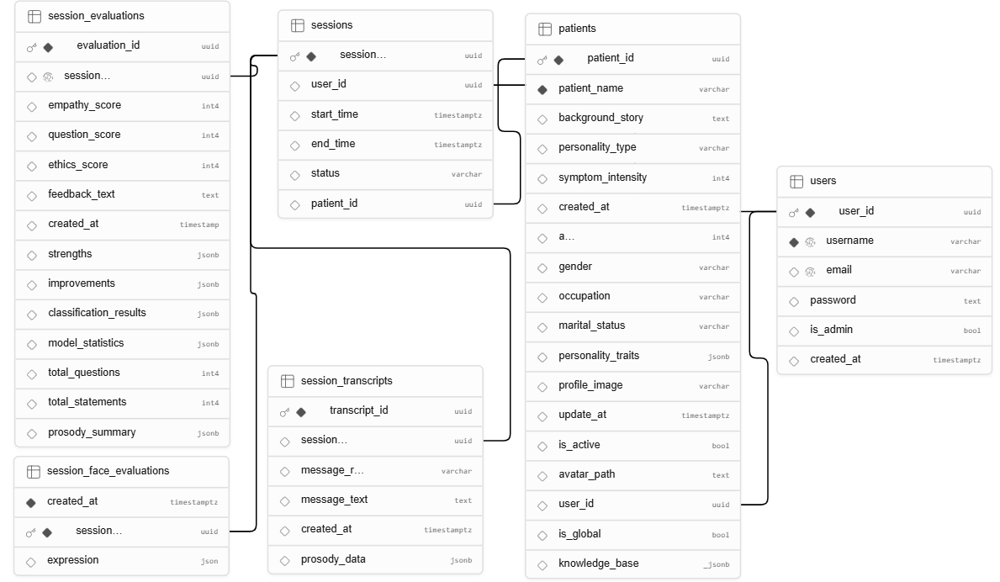

# Tutor AI Psychiatry Backend API

<p align="center">
  
</p>

## One-line Description
The core REST API and database integration server for the Tutor AI Psychiatry counseling simulation platform.

## Badges
[](https://nodejs.org/)
[](https://expressjs.com/)
[](https://supabase.com/)
[](https://swagger.io/)

## Screenshots (Swagger + System)
<p align="center">
  
</p>

## Features
- **User Authentication:** Secure registration, login, logout, profile updates, and password changes using JWT and bcryptjs.
- **Patient Management:** Complete CRUD actions for patient data, RAG embedding generation, and 3D avatar path configuration.
- **Session Lifecycles:** Real-time counseling session initialization and completion, with automated end time generation.
- **Reporting & Diagnostics:** Aggregation of counselor empathy metrics, question-type evaluations, and prosody parameters.
- **API Documentation:** OpenAPI 3.0 specification rendered dynamically via Swagger UI.

## Architecture Diagram


## Tech Stack
- **Framework:** Node.js, Express.js
- **Database Wrapper:** Supabase Client SDK
- **Security:** JSONWebToken (JWT), bcryptjs
- **Documentation Parser:** yamljs, swagger-ui-express
- **Process Manager:** nodemon (development)

## Getting Started

### Prerequisites
- Node.js (version 18.x or higher)
- npm (Node Package Manager)

### Installation
1. Navigate to the backend directory:
   ```bash
   cd tutor-ai-psy-backend
   ```
2. Install package dependencies:
   ```bash
   npm install
   ```

### Running the Server
Run the development server using nodemon:
```bash
npm run dev
```
The server will start on `http://localhost:3000` (or the port specified in your `.env` file).

## Environment Variables
Create a `.env` file in the root of the backend folder:
```ini
PORT=3000
NODE_ENV=development
SUPABASE_URL=your_supabase_url
SUPABASE_SERVICE_ROLE_KEY=your_supabase_service_role_key
DATABASE_URL=your_postgresql_database_url
JWT_SECRET=your_jwt_secret_key
GEMINI_API_KEY=your_gemini_api_key
ELEVEN_LABS_API_KEY=your_elevenlabs_api_key
PYTHON_API_URL=http://localhost:8000
MODEL_API_URL=http://localhost:3000
```

## API Documentation
The API endpoints are documented using OpenAPI 3.0. When the server is running, access the interactive Swagger documentation UI at:
`http://localhost:3000/api-docs`

### Database Schema Overview
The database schema relationships and tables are integrated via Supabase:
<p align="center">
  
</p>

### Endpoint Summary

#### Authentication (`/api/auth`)
- `POST /register` - Register a new user
- `POST /login` - Log in a user
- `POST /logout` - Log out the current user
- `GET /session` - Retrieve active session details
- `PUT /profile` - Update profile data
- `POST /update-password` - Update password
- `DELETE /delete-account` - Permanently delete account

#### Patient Management (`/api/patients`)
- `POST /` - Create a new patient record
- `GET /` - Retrieve all patients
- `GET /:id` - Retrieve patient details by ID
- `PUT /:id` - Update patient record (triggers RAG embeddings migration)
- `DELETE /:id` - Delete patient record
- `POST /migrate-embeddings` - Run embedding generation for empty records
- `GET /model/:patientId` - Get patient 3D model path

#### Session Management (`/api/sessions`)
- `POST /` - Start a new counseling session
- `GET /` - List all counseling sessions
- `GET /:id` - Retrieve session details
- `PATCH /:id` - Update session status (ongoing, completed, cancelled)

#### Report & Analytics (`/api/reports`)
- `POST /:session_id/analyze` - Run automated ML analysis & save session evaluations
- `GET /transcripts/:session_id` - Fetch transcript logs for a session
- `GET /evaluation/:session_id` - Retrieve diagnostic scores and qualitative feedback
- `POST /evaluation/:session_id` - Manually save or adjust evaluation score
- `GET /patient/:patient_id` - Fetch session statistics for a specific patient
- `GET /user/me/statistics` - Fetch overall counselor session statistics
- `GET /stats` - Retrieve aggregate average performance statistics

#### Chat (`/api/chat`)
- `POST /` - Submit counselor chat input
- `GET /persona/:session_id` - Retrieve persona configuration for a session
- `POST /set-persona-from-patient` - Configure active AI patient persona

## Project Structure
```
tutor-ai-psy-backend/
├── docs/
│   └── assets/         # Diagrams and screenshots
├── middleware/         # Auth verification middleware
├── models/             # Supabase data models (patients, sessions, evaluations)
├── routes/             # Express route files
├── services/           # External API service implementations
├── index.js            # App configuration and entrypoint
└── openApi.yaml        # OpenAPI schema definitions
```

## Future Improvements
- Secure log-rotation and automated API key rotation mechanisms.
- Comprehensive unit and integration testing across service modules.
- Query optimization and vector index tuning in Supabase for larger datasets.

## Author
Maintained and developed by Commulab Team.
