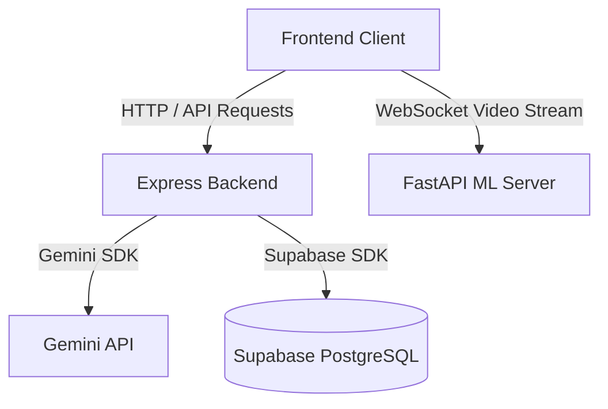

# CommuLab Backend API

The core REST API and database integration server for CommuLab, an interactive counseling communication simulation and analysis training platform.

Frontend [here](https://github.com/aipsychotutor/tutor-ai-psy-frontend) | Model [here](https://github.com/aipsychotutor/tutor-ai-psy-ai-model-server)

[](https://nodejs.org/)
[](https://expressjs.com/)
[](https://supabase.com/)
[](https://swagger.io/)


CommuLab enables counselors-in-training to simulate conversations with AI-driven clients, analyzing communication effectiveness through text, prosody, and facial expressions. The backend handles user session states, routes counselor inputs to classification engines, manages client records, and aggregates diagnostic metrics into comprehensive reports.

## Features

- **Session Lifecycles:** Initialize, track, and close interactive counseling sessions. Ending a session automatically triggers timestamp calculations.
- **Client & Persona Management:** Manage client records, background stories, and handle embedding generation for RAG-based persona prompts.
- **Performance Analytics:** Aggregate counselor empathy levels, question styles, and vocal characteristics into qualitative reports.
- **User Management:** Access control and secure user profiles powered by JWT and bcryptjs.
- **OpenAPI 3.0 Documentation:** Interactive API testing interface served directly from the server.

## System Architecture



## Tech Stack

- **Server Framework:** Node.js, Express.js
- **Audio & Media Processing:** `ffmpeg-static` (bundled cross-platform binary) & Rhubarb Lip Sync
- **Database Client:** Supabase SDK (PostgreSQL integration)
- **Security:** JSONWebToken (JWT) & bcryptjs
- **Documentation:** yamljs & swagger-ui-express
- **Development Tooling:** nodemon

## Getting Started

### Prerequisites

- **Node.js**: version 18.x or higher
- **npm**: Node Package Manager
- **FFmpeg**: Automatically bundled and handled via `ffmpeg-static` (no manual system install needed)
- **Rhubarb LipSync**: Binaries in `bin/rhubarb.exe` with accompanying `bin/res/` assets (for lipsync generation)
- **FastAPI AI Model Server**: Running on `http://localhost:8000` (for question classification, empathy scoring, and speech prosody)

### Installation & Setup

1. **Navigate to the backend directory:**
   ```bash
   cd tutor-ai-psy-backend
   ```
2. **Install package dependencies:**
   ```bash
   npm install
   ```
3. **Set up Rhubarb Lip Sync (Required for 3D Avatar LipSync):**
   - Download the latest release from [Rhubarb Lip Sync Releases](https://github.com/DanielSWolf/rhubarb-lip-sync/releases).
   - Extract and ensure `rhubarb.exe` and the `res/` folder are placed inside the `bin/` directory:
     ```
     tutor-ai-psy-backend/
     └── bin/
         ├── rhubarb.exe
         └── res/
     ```
4. **Ensure `audios/` storage directory exists:**
   Create the directory if it does not already exist (used for storing temporary audio and phoneme JSON chunks):
   ```bash
   mkdir audios
   ```
5. **Set up environment variables:**
   Copy `.env.example` to `.env` and fill in your credentials:
   ```bash
   cp .env.example .env
   ```

### Running the Server

Start the API server in development mode (with hot-reload via nodemon):
```bash
npm run dev
```
The server will start on `http://localhost:3000` (or your configured environment port).

## Environment Variables

Configure your `.env` file in the root of the backend folder:
```ini
PORT=3000
NODE_ENV=development

# Database (Supabase)
SUPABASE_URL=your_supabase_url
SUPABASE_SERVICE_ROLE_KEY=your_supabase_service_role_key

# Security
JWT_SECRET=your_jwt_secret_key

# AI & Speech Services
GEMINI_API_KEY=your_gemini_api_key
ELEVEN_LABS_API_KEY=your_elevenlabs_api_key
GROQ_API_KEY=your_groq_api_key

# Microservices
PYTHON_API_URL=http://localhost:8000
API_URL=http://localhost:3000
```

## Interactive API Documentation

Once the server is running, you can explore and test the endpoints via the built-in Swagger UI:
`http://localhost:3000/api-docs`


### Database Schema Overview
The database relationships and schema layout managed in Supabase:


### Endpoints Overview

#### Authentication (`/api/auth`)
- `POST /register` - Register a new counselor account
- `POST /login` - Account login
- `POST /logout` - Clear active session
- `GET /session` - Fetch current user session details
- `PUT /profile` - Update profile data
- `POST /update-password` - Reset password
- `DELETE /delete-account` - Permanently delete account

#### Client Management (`/api/patients`)
- `POST /` - Register a new client profile
- `GET /` - List all accessible clients
- `GET /:id` - Fetch details for a specific client
- `PUT /:id` - Update client information (regenerates RAG embeddings)
- `DELETE /:id` - Delete client profile
- `POST /migrate-embeddings` - Run embedding generation for empty records
- `GET /model/:patientId` - Fetch 3D model paths

#### Session Management (`/api/sessions`)
- `POST /` - Begin a new counseling session
- `GET /` - List all counseling sessions
- `GET /:id` - Retrieve session details
- `PATCH /:id` - Update session status (completed/cancelled will auto-generate end_time)

#### Report & Analytics (`/api/reports`)
- `POST /:session_id/analyze` - Run ML analysis and save counseling evaluations
- `GET /transcripts/:session_id` - Fetch session transcript logs
- `GET /evaluation/:session_id` - Retrieve diagnostic scores and qualitative feedback
- `POST /evaluation/:session_id` - Manually save or adjust evaluation score
- `GET /patient/:patient_id` - Fetch session statistics for a specific client
- `GET /user/me/statistics` - Fetch overall counselor session statistics
- `GET /stats` - Retrieve aggregate average performance statistics

#### Chat (`/api/chat`)
- `POST /` - Submit counselor chat input
- `GET /persona/:session_id` - Retrieve persona configuration for a session
- `POST /set-persona-from-patient` - Configure active AI client persona

## Project Structure
```
tutor-ai-psy-backend/
├── docs/
│   └── assets/         # System diagrams and screenshots
├── middleware/         # Auth validation middleware
├── models/             # Supabase abstraction models
├── routes/             # API route endpoints
├── services/           # External service handlers (Gemini, Speech APIs)
├── index.js            # Main Express configurations
└── openApi.yaml        # Swagger documentation schema
```

## Author
Developed and maintained by the CommuLab Team.
